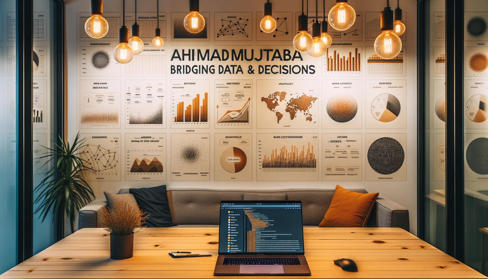
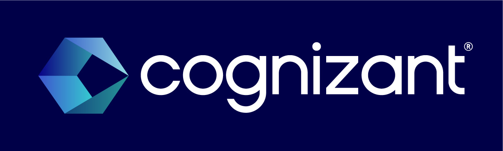
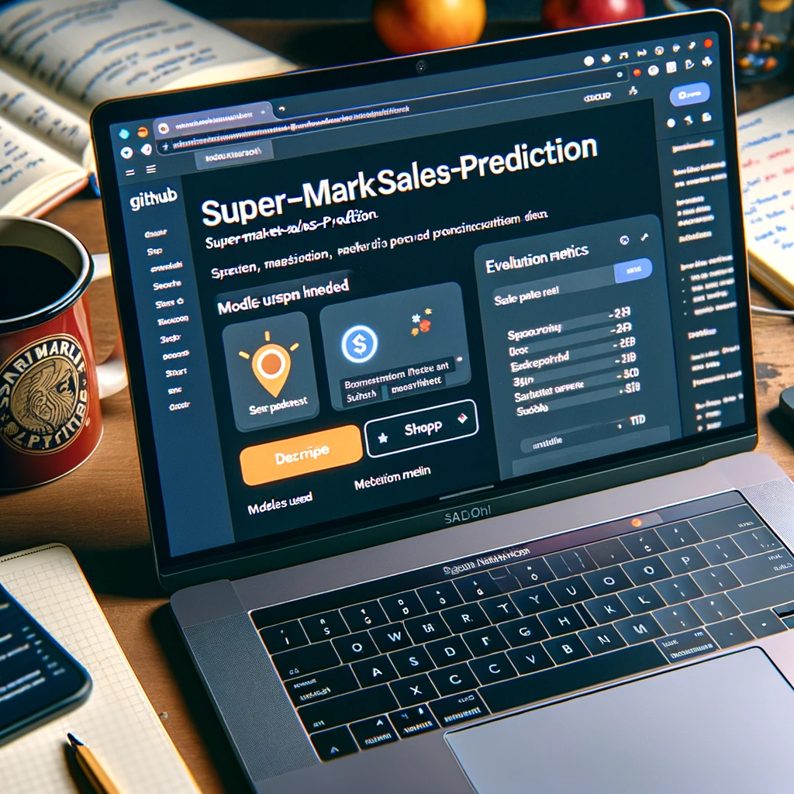
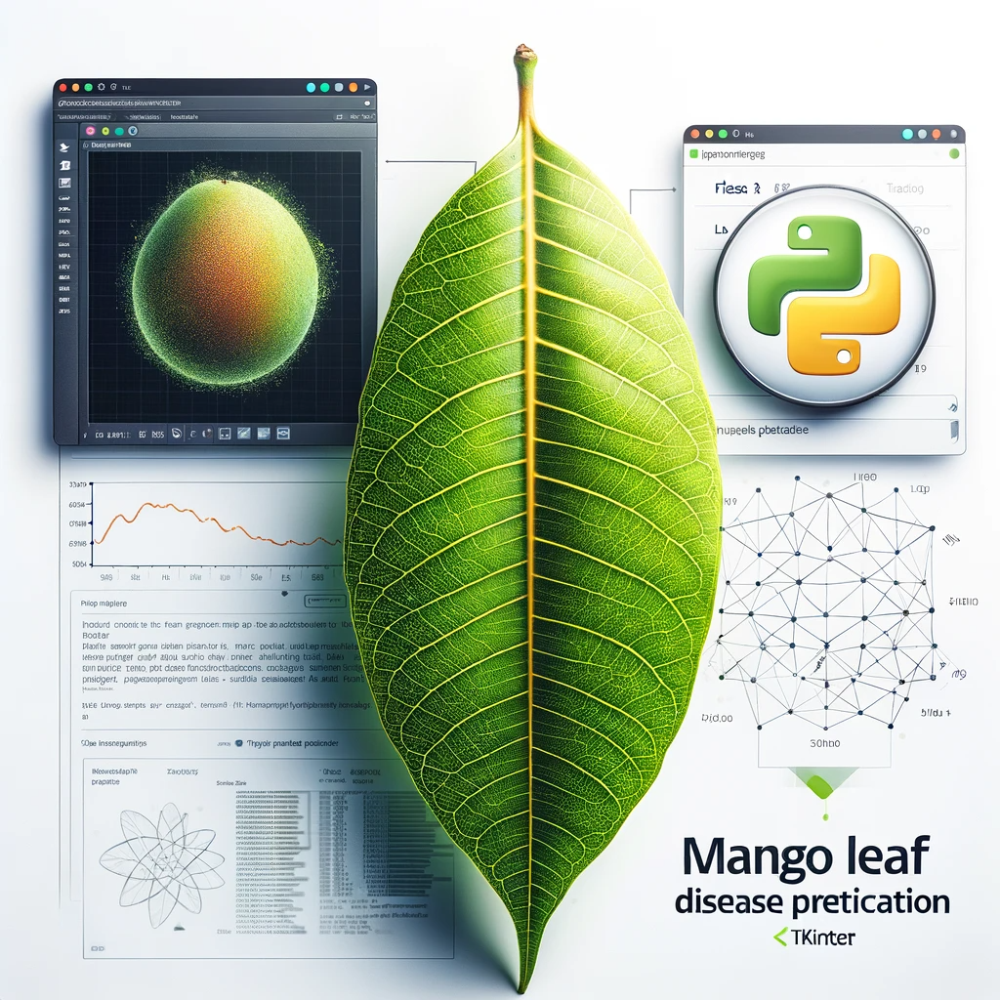
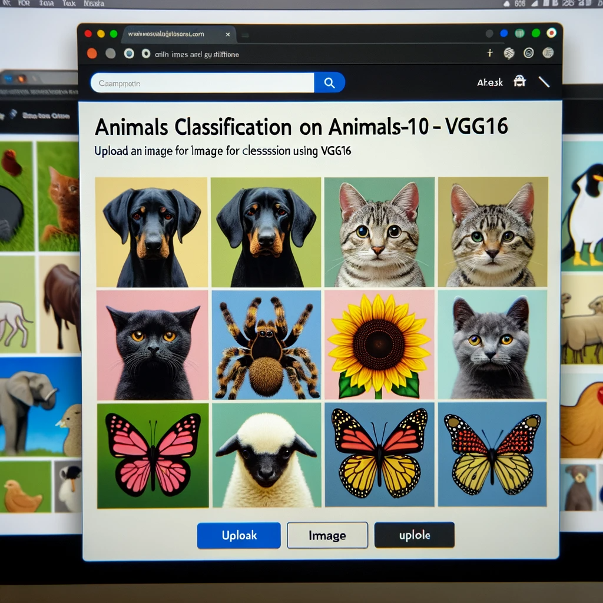
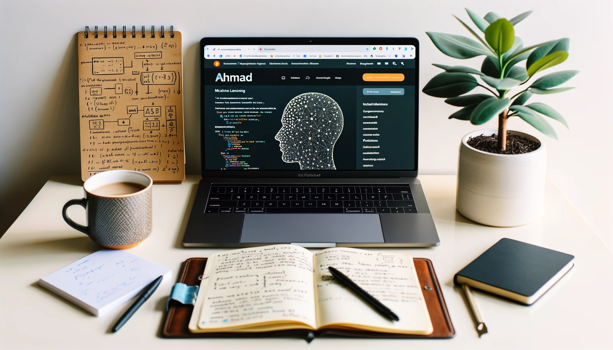

Image generated by DALL·E 3

# 👨‍💼 Ahmad's Portfolio

🌟 Welcome to my portfolio page where I showcase my machine learning and data science projects, along with my certifications. 🌟

## 🌍 Overview

  
  
Image generated by DALL·E 3

- 🏢 **Position**: Associate Data Scientist
- 🏦 **Company**: Cognizant Technology Solutions, Hyderabad, India
- 🌏 **Location**: Hyderabad, India

## 🚀 Skills

- 🖥️ Programming Languages: Python, R, SQL.
- 🤖 Machine Learning Libraries: Scikit-learn, Numpy, Pandas, Matplotlib, Seaborn.
- 🤖 Machine Learning Techniques: Regression, Classification, Clustering, Decision Tree, Dimensionality Reduction, Ensemble Methods (Random Forest, XGBoost).
- 🧠 Deep Learning: CNN, RNN, LSTM, TensorFlow, PyTorch, Transfer Learning, OpenCV, NLTK, Natural Language Processing, Computer Vision.
- 🔍 Data Science & Miscellaneous Technologies: Data science pipeline (cleansing, wrangling, visualization, modeling, interpretation), Statistics, Probability, Time Series, Git, Streamlit.
- 📊 Data Analysis Tools: Microsoft Excel, Microsoft Power BI, PySpark, MS SQL, Oracle SQL, Azure Databricks.
- ☁️ Cloud Technologies: Azure, Microsoft LUIS (Language Understanding).

## 👔 Professional Experience

### COGNIZANT TECHNOLOGY SOLUTIONS, Hyderabad  (September 2022 - Present)

  
  
Credit: Cognizant

- Specialized in ML and NLP using Azure Databricks, PowerBI, and SQL, adapting to shifts and different time zones to meet client demands.
- Developed and refined ML/NLP applications, ensuring updates aligned with client requirements.
- Designed interactive data dashboards in PowerBI, translating complex data into intuitive visuals.
- Utilized Azure Databricks for comprehensive data management, from ingestion to analysis.
- Collaborated with diverse teams to provide data-driven solutions and effectively communicated insights to varied audiences.
- Maintained optimal application performance, promptly addressing bugs and deploying updates, especially for an NLP web application on Azure.

### AiEnsured, Bangalore (Intern) (July 2021 - August 2021)
- Implemented machine learning techniques for optimizing TensorFlow lite, reducing process time and memory usage.
- Designed and optimized deep learning models for efficiency.
- Collaborated with the team to enhance machine learning solutions.

### IIIT Kurnool (Teaching Assistant) (March 2021 - March 2022)
- Led recitations, graded coursework, and assisted students in understanding machine learning concepts.

## 📜 Certifications

**Machine Learning Specialization** - January 17, 2023  
_Institution_: DeepLearning.AI via Coursera  
**Courses Covered**:  
- Supervised Machine Learning: Regression and Classification
- Advanced Learning Algorithms
- Unsupervised Learning, Recommenders, Reinforcement Learning  
**Instructors**: Andrew Ng, Eddy Shyu, Aarti Bagul, Geoff Ladwig  
_Description_: Completed a comprehensive specialization on machine learning, including topics like supervised and unsupervised learning, recommender systems, and reinforcement learning. Gained practical skills for implementing machine learning solutions to real-world challenges.  
[Verify Certification](https://coursera.org/verify/specialization/2T5GNSDSV29S)

**Additional Certificates**:
- [Udemy Certificates on GitHub](https://github.com/pypi-ahmad/Udemy-Certificates)
- [Coursera Certificates on GitHub](https://github.com/pypi-ahmad/Coursera-Certificates)

## 🎨 Projects

- [Image Steganography Tool](https://github.com/pypi-ahmad/Image-Steganography-Tool)
  

    
    
Image generated by DALL·E 3

  

- [Super Market Sales Prediction](https://github.com/pypi-ahmad/Super-Market-Sales-Prediction)
  

    
    
Image generated by DALL·E 3

  

- [Mango Leaf Disease Prediction](https://github.com/pypi-ahmad/Mango-Leaf-Disease-Prediction)
  

    
    
Image generated by DALL·E 3

  

- [Animals Classification on Animals-10 Dataset using VGG16](https://github.com/pypi-ahmad/Animals-Classification-on-Animals-10-Dataset-using-VGG16)
  

    
    
Image generated by DALL·E 3

  

- ...and [more](https://github.com/pypi-ahmad?tab=repositories)

## 📚 Resources

- [Cheatsheets](https://github.com/pypi-ahmad/Cheatsheets)
- [Classification Templates](https://github.com/pypi-ahmad/Classification-Templates)
- [Regression Templates](https://github.com/pypi-ahmad/Regression-Templates)
- [Data Preprocessing Tools and Templates](https://github.com/pypi-ahmad/Data-Preprocessing-Tools-and-Templates)
- [Face Recognition Flask App](https://github.com/pypi-ahmad/FaceRecognition_Flask)
- [Machine Learning Model Selection](https://github.com/pypi-ahmad/Machine-Learning-Model-Selection)

## 📄 Resume

Interested in diving deeper into my professional journey? Check out my detailed resume [here](https://github.com/pypi-ahmad/My-Resume).

## 💌 Contact

- 📡 Telegram Channel: [MLDS Insights](https://t.me/MLDSInsights)
- 📱 Telegram Account: [Peaceful Data Mind](https://t.me/peacefuldatamind)
- 🌐 LinkedIn: [Profile](https://www.linkedin.com/in/ahmad-iiitk/)
- 📺 YouTube: [Channel](https://www.youtube.com/channel/UC38wvN6ZalnJAKjel48i18w)
- 📸 Instagram: [Peaceful Data Mind](https://www.instagram.com/peacefuldatamind/)
- 📊 Kaggle: [pypiahmad](https://www.kaggle.com/pypiahmad)

  
  
Image generated by DALL·E 3

