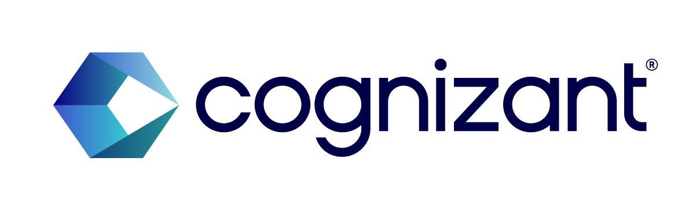

Image generated by DALL·E 3

# 👨‍💼 Ahmad's Portfolio

Welcome to my portfolio page where I showcase my machine learning and data science projects, along with my certifications.

## Overview

  

  

Image generated by DALL·E 3

- **Position**: Associate Data Scientist
- **Company**: Cognizant Technology Solutions, Hyderabad, India
- **Location**: Hyderabad, India

## Skills

- Programming Languages: Python, R, SQL.
- Machine Learning: scikit-learn, numpy, pandas, matplotlib, seaborn, Regression, Classification, Clustering, Decision Tree, Dimensionality Reduction, Ensemble Methods (Random Forest, XGBoost).
- Deep Learning: CNN, RNN, LSTM, TensorFlow, PyTorch, Transfer Learning, OpenCV, NLTK, Natural Language Processing, Computer Vision.
- Data Science & Miscellaneous Technologies: Data science pipeline (cleansing, wrangling, visualization, modeling, interpretation), Statistics, Probability, Time Series, Git, Streamlit.
- Data Analysis: Microsoft Excel, Microsoft Power BI, PySpark, MS SQL, Oracle SQL, Azure Databricks.
- Cloud Technologies: Azure, Microsoft LUIS (Language Understanding).

## Professional Experience

### COGNIZANT TECHNOLOGY SOLUTIONS, Hyderabad  (September 2022 - Present)
  

  

Image generated by DALL·E 3

- Specialized in ML and NLP with Azure.
- Created interactive data dashboards with Microsoft PowerBI.
- Leveraged Azure Databricks for data ingestion and transformation.
- Maintained an NLP web app on Azure, including updates and bug fixes.
- Adaptable to different shifts and time zones for project delivery.
- Effectively communicated findings to both technical and non-technical stakeholders.
- Worked with cross-functional teams to deliver data-driven solutions
- Proactively identified and resolved application bugs.

### AiEnsured, Bangalore (Intern) (July 2021 - August 2021)
- Implemented ML for TensorFlow optimization.
- Designed efficient deep learning models.

### IIIT Kurnool (Teaching Assistant) (March 2021 - March 2022)
- Led recitations, graded coursework, and assisted students in understanding machine learning concepts.

## 🛠️ Projects

- [Image Steganography Tool](https://github.com/pypi-ahmad/Image-Steganography-Tool)
  
- [Super Market Sales Prediction](https://github.com/pypi-ahmad/Super-Market-Sales-Prediction)
    
  

    
  

  Image generated by DALL·E 3

- [Mango Leaf Disease Prediction](https://github.com/pypi-ahmad/Mango-Leaf-Disease-Prediction)
    
  

    
  

  Image generated by DALL·E 3
  
- [Animals Classification on Animals-10 Dataset using VGG16](https://github.com/pypi-ahmad/Animals-Classification-on-Animals-10-Dataset-using-VGG16)

- ...and [more](https://github.com/pypi-ahmad?tab=repositories)

## 📚 Resources

- [Cheatsheets](https://github.com/pypi-ahmad/Cheatsheets)
- [Classification Templates](https://github.com/pypi-ahmad/Classification-Templates)
- [Regression Templates](https://github.com/pypi-ahmad/Regression-Templates)
- [Data Preprocessing Tools and Templates](https://github.com/pypi-ahmad/Data-Preprocessing-Tools-and-Templates)
- [Face Recognition Flask App](https://github.com/pypi-ahmad/FaceRecognition_Flask)
- [Machine Learning Model Selection](https://github.com/pypi-ahmad/Machine-Learning-Model-Selection)

## 🎓 Certifications

- [Udemy Certificates](https://github.com/pypi-ahmad/Udemy-Certificates)
- [Coursera Certificates](https://github.com/pypi-ahmad/Coursera-Certificates)

## 📬 Contact

- Telegram Channel: [MLDS Insights](https://t.me/MLDSInsights)
- Telegram Account: [Peaceful Data](https://t.me/peacefuldata)
- LinkedIn: [Profile](https://www.linkedin.com/in/ahmad-iiitk/)
- YouTube: [Channel](https://www.youtube.com/channel/UC38wvN6ZalnJAKjel48i18w)
- Instagram: [Peaceful Data Mind](https://www.instagram.com/peacefuldatamind/)

Image generated by DALL·E 3

